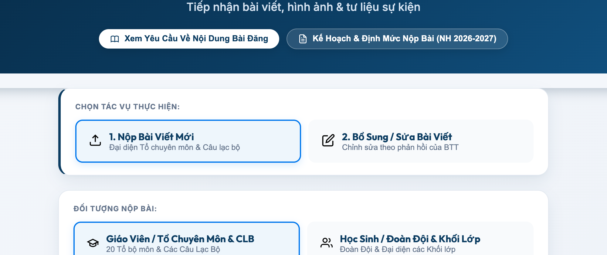
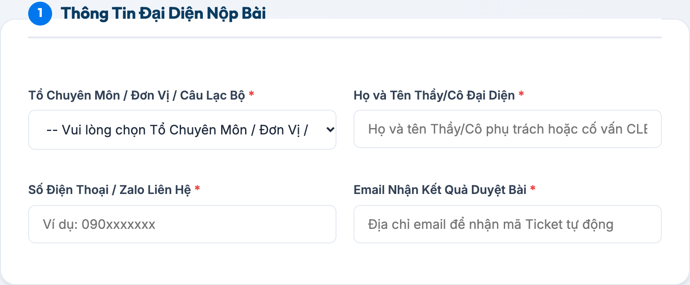
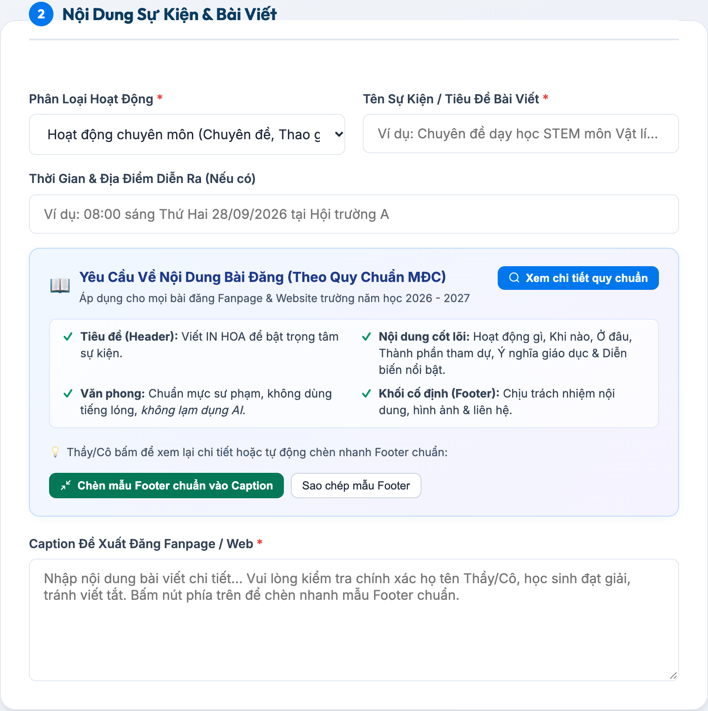
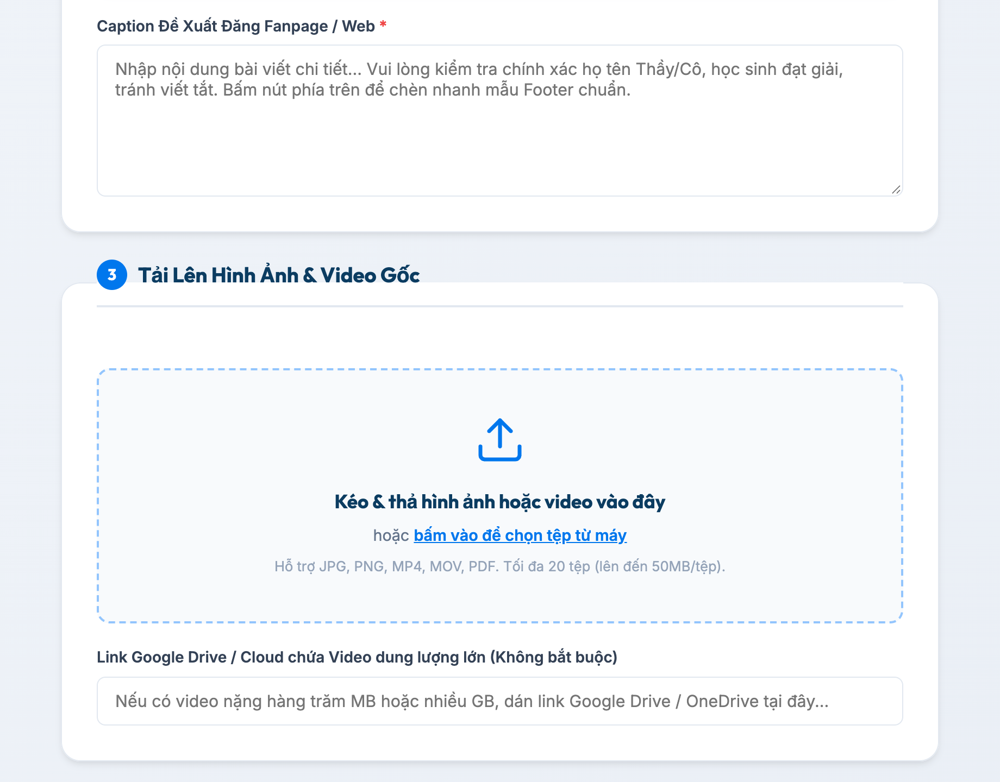
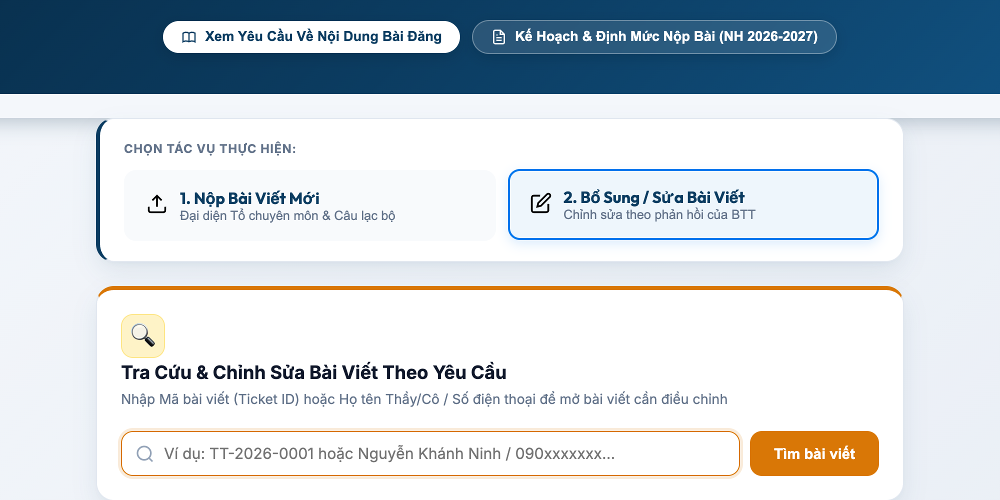

# 📱 HƯỚNG DẪN THẦY/CÔ NỘP BÀI TRUYỀN THÔNG NHANH
### Cẩm nang thao tác trên điện thoại & máy tính — THPT Mạc Đĩnh Chi

> **Kính gửi Quý Thầy/Cô đại diện các Tổ Chuyên môn và Câu Lạc Bộ,**  
> Để việc gửi tin bài, hình ảnh hoạt động của tổ mình về Ban Truyền Thông diễn ra nhanh nhất (chỉ mất 2 – 3 phút), Thầy/Cô không cần đăng nhập Gmail phức tạp mà có thể nộp trực tiếp qua Cổng tiếp nhận trực tuyến của trường:  
> 👉 **Địa chỉ website:** [https://bantruyenthong.pages.dev/](https://bantruyenthong.pages.dev/)

---

### 🌟 Ưu điểm tiện lợi cho Thầy/Cô:
* ✅ **Không cần tài khoản Google / Gmail:** Mở link trên điện thoại hay máy tính là nộp được ngay.
* ✅ **Tự động cấp mã bài (Ticket ID):** Có mã dạng `TT-2026-XXXX` và email gửi về hộp thư để Thầy/Cô theo dõi tiến độ duyệt.
* ✅ **Tải ảnh thoải mái:** Hỗ trợ tải cùng lúc tối đa 20 file ảnh/video ngắn (50MB/tệp). Nếu có video nặng thì chỉ cần dán link Google Drive.
* ✅ **Tiện ích chèn chân trang (Footer):** Có nút bấm tự động chèn sẵn thông tin liên hệ chuẩn của trường.

---

## 🚀 4 BƯỚC THAO TÁC NỘP BÀI VIẾT MỚI

### 🔹 BƯỚC 1: Mở web và chọn đối tượng nộp bài
* Thầy/Cô bấm vào link: [https://bantruyenthong.pages.dev/](https://bantruyenthong.pages.dev/)
* Ở thanh tác vụ đầu trang, hệ thống đã chọn sẵn mặc định:
  - Tác vụ: **"1. Nộp Bài Viết Mới"**
  - Đối tượng: **"Giáo Viên / Tổ Chuyên Môn & CLB"**
* 👉 **Thầy/Cô chỉ cần giữ nguyên lựa chọn này.**

---

### 🔹 BƯỚC 2: Điền thông tin Thầy/Cô đại diện
Tại khung **1️⃣ Thông Tin Đại Diện Nộp Bài**, Thầy/Cô điền 4 thông tin cơ bản:
1. **Tổ Chuyên Môn / Đơn Vị / CLB:** Bấm chọn đúng tên Tổ của mình (Toán, Vật lí, Hóa học, Ngữ văn, Tiếng Anh, CLB...).
2. **Họ và Tên Thầy/Cô Đại Diện:** Điền họ tên Thầy/Cô phụ trách bài viết.
3. **Số Điện Thoại / Zalo:** Điền số điện thoại để BTT tiện nhắn tin/trao đổi nhanh khi duyệt gấp.
4. **Email Nhận Kết Quả:** Điền chính xác email để nhận thư xác nhận kèm Mã Ticket tự động.

---

### 🔹 BƯỚC 3: Nhập nội dung sự kiện & Viết Caption
Tại khung **2️⃣ Nội Dung Sự Kiện & Bài Viết**, Thầy/Cô điền:
* **Phân loại hoạt động:** Chọn Hoạt động chuyên môn, Hoạt động học sinh, Đoàn - Phong trào, Hội thi, Khen thưởng...
* **Tên Sự Kiện / Tiêu Đề Bài Viết:** Viết ngắn gọn trọng tâm *(Ví dụ: Chuyên đề STEM môn Vật lí...)*.
* **Thời Gian & Địa Điểm:** Ghi rõ thời gian, phòng học / hội trường diễn ra sự kiện.
* **Caption Đề Xuất Đăng Fanpage / Web:** Soạn nội dung bài viết (hoặc dán từ Word sang).

> 💡 **MẸO CỰC NHANH DÀNH CHO THẦY/CÔ:**  
> Ngay phía trên ô Caption có nút màu xanh: **[Chèn mẫu Footer chuẩn vào Caption]**.  
> Thầy/Cô chỉ cần bấm 1 cái vào nút này, hệ thống sẽ tự động chèn sẵn toàn bộ thông tin chuẩn của trường gồm: *Chịu trách nhiệm nội dung, Chịu trách nhiệm hình ảnh, Địa chỉ trường (Số 4 Tân Hòa Đông), Link Website, Fanpage và Hashtag*. Thầy/Cô chỉ việc viết nội dung sự kiện ở phía trên và điền tên mình vào là xong!

---

### 🔹 BƯỚC 4: Tải ảnh/video và bấm Gửi bài
Tại khung **3️⃣ Tải Lên Hình Ảnh & Video Gốc**:
1. **Chọn ảnh từ máy:** Bấm vào khung nét đứt có biểu tượng đám mây để chọn ảnh từ album điện thoại hoặc máy tính (chọn được nhiều ảnh cùng lúc, hỗ trợ JPG, PNG, MP4, PDF, Word).
2. **Nếu có Video dung lượng lớn (hàng trăm MB - hàng GB):** Thầy/Cô tải lên Google Drive cá nhân, mở quyền xem và dán link vào ô *"Link Google Drive / Cloud chứa Video dung lượng lớn"*.
3. **Bấm nút GỬI BÀI DUYỆT TRUYỀN THÔNG:**  
   - Chờ từ 5 – 15 giây để hệ thống tải file lên Drive của trường.
   - Màn hình sẽ hiện thông báo chúc mừng: **🎉 NỘP BÀI THÀNH CÔNG!** kèm mã bài viết dạng `TT-2026-XXXX`.
   - Một email xác nhận tiếp nhận cũng được gửi ngay về hòm thư của Thầy/Cô.

---

## 🔄 KHI CẦN: CÁCH TRA CỨU & BỔ SUNG / SỬA BÀI THEO PHẢN HỒI

Nếu Ban Biên Tập duyệt bài và nhận thấy cần bổ sung ảnh nét hơn hoặc đính chính danh sách học sinh đạt giải, Thầy/Cô **KHÔNG CẦN** nộp lại bài mới từ đầu, mà chỉ cần:

1. Bấm vào tab **"2. Bổ Sung / Sửa Bài Viết"** ở đầu trang web.
2. Nhập **Mã bài viết (Ticket ID)** (Ví dụ: `TT-2026-0012`) hoặc nhập **Số điện thoại / Họ tên** ➔ Bấm **"Tìm bài viết"**.
3. Xem hộp phản hồi màu vàng: Đọc kỹ lời dặn của BTT xem cần bổ sung chi tiết nào.
4. Chỉnh sửa lại Caption trực tiếp trong ô hoặc bấm chọn thêm ảnh mới.
5. Bấm nút **"GỬI BẢN CẬP NHẬT CHỈNH SỬA"**. Trạng thái sẽ tự chuyển thành `ĐÃ SỬA – CHỜ DUYỆT` để BTT ưu tiên duyệt đăng ngay cho Tổ.

---

## 📌 VÀI LƯU Ý NHỎ GIÚP BÀI ĐĂNG HOÀN HẢO

* **Thời điểm gửi bài lý tưởng:** Gửi trong vòng **24h – 48h** sau khi sự kiện kết thúc để bài đăng giữ được độ lan tỏa và tương tác cao nhất.
* **Chất lượng hình ảnh:** Thầy/Cô ưu tiên gửi ảnh gốc sắc nét, hạn chế gửi qua Zalo dạng thường vì ảnh sẽ bị giảm chất lượng khi đăng lên Fanpage.
* **Hỗ trợ kỹ thuật bất cứ lúc nào:**
  - **Thầy Nguyễn Hồ Trọng Tín** (Tổ Tin học - Kỹ thuật BTT).
  - Thầy/Cô có thể nhắn trực tiếp qua nhóm Zalo Truyền Thông MĐC để được hỗ trợ nhanh nhất.

---
*Ban Truyền Thông trường THPT Mạc Đĩnh Chi trân trọng cảm ơn sự đồng hành của Quý Thầy/Cô! ❤️*
